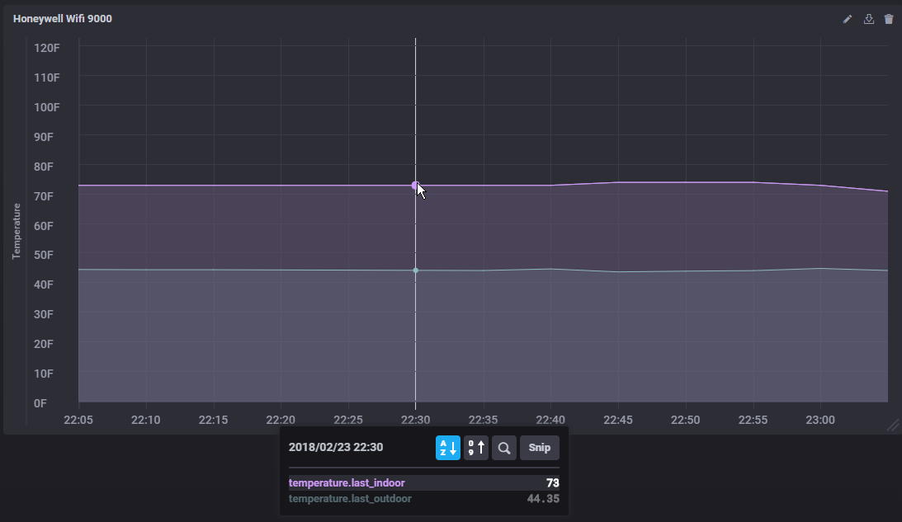

# tccstats
A script I use to gather statistics from my Honeywell Wifi 9000 thermostat and the Dark Sky weather service.  It's probably not too useful to anyone else, but could serve as a reference for talking to these services.

I use Dark Sky to track outside temperature since I found that the Honeywell doesn't seem to be super accurate (it relies on a third party weather service also, but it seems to update only very infrequently).  Dark Sky lets you query their service for free up to 1000 times a day.  I poll once every five minutes so this works out nicely.

I store the data in an InfluxDB database and visualize it via Grafana and Chronograf.

## Python Modules Needed
- python-suds
- darksky
- influxdb

## Honeywell TCC API
For the Wifi 9000 thermostat, you need to talk to your TCC account via the MobileV2 API.  It has a SOAP and HTTP interface.  From searching around, I found that the Application ID to use is **a0c7a795-ff44-4bcd-9a99-420fac57ff04**.

You can view the API docs [here](https://tccna.honeywell.com/ws/MobileV2.asmx).

## Sample Graph (Chronograf)

