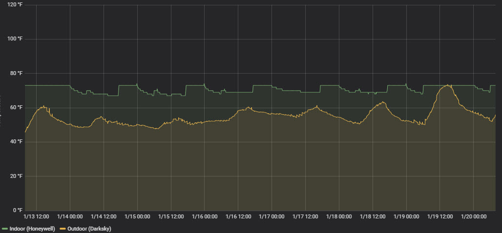

# tccstats
A script I use to gather statistics from my Honeywell Wifi 9000 thermostat and the Pirate Weather weather service.  It's probably not too useful to anyone else, but could serve as a reference for talking to these services.

I use Pirate Weather to track outside temperature since I found that the Honeywell doesn't seem to be super accurate (it relies on a third party weather service also, but it seems to update only very infrequently).  Pirate Weather lets you query their service for free up to 10,000 times a month.  A previous version of this script relied on Dark Sky, which was discontinued in March, 2023.

The script was developed on CentOS 7's built-in Python 2.7.5.  All Python modules were either installed via yum/EPEL or pip.

I store the data in an InfluxDB database and visualize it via Grafana and Chronograf.

## Python Modules Needed
- requests_oauthlib
- requests
- influxdb

## Usage
Quick and dirty:

- Copy tccstats.conf.sample to tccstats.conf.  Modify it as needed.
- You'll need to authorize the script to run (will need to build this
  functionality in)

## Honeywell TCC API
The generic Application ID I was using against the TCC MobileV2 API stopped
working.  As such, I've modifed the code to use the [TCCP RESTful API](https://mytotalconnectcomfort.com/WebApi/Help/ApiIntroduction).

To make calls against the TCC RESTful API, you need to contact Honeywell and
ask them create you an Application.  They'll ask you for a callback URL and in
return you'll receive an API key and secret.

You'll also need to know the Device ID of your thermostat.  Currently you need
to discover it manually via API calls (using cURL or Postman).  It's on my
TODO list to enable the app to list all devices.

## Sample Graph (Chronograf)

